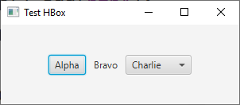
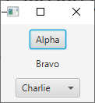
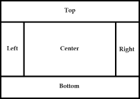
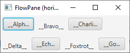
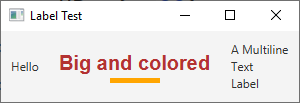
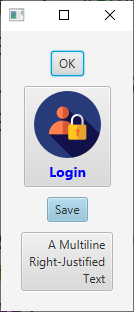
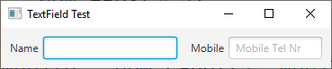

class: center, middle

# Les IHM avec JavaFX
### Ce cours est adapté de celui de l'IUT Info d'Aix-en-Provence rédigé par
###Sébastien NEDJAR 

---

class: center, middle

# Introduction
---
# Historique
- Les premières IHM en Java se faisaient en utilisant **la bibliothèque AWT** (Composants "lourds")
    
- Rapidement, **la bibliothèque Swing** est venue remplacer AWT : composants "légers" dessinés par la bibliothèque, pluggable Look&Feel
    
- **JavaFX 1** a tenté – sans grand succès – de remplacer Swing : basé sur un langage de script (JavaFX Script)

- Une refonte importante du *toolkit* a pris en compte les critiques formulées et a conduit à une nouvelle mouture : **JavaFX 2**

- Caractéristiques principales :
    - Abandon du langage de script  
    - Possibilité d'utiliser l'API et/ou un langage descriptif (syntaxe *XML*)
    - Possibilité de génération de FXML via l'outil interactif **Scene Builder**
    - Utilisation possible de feuilles de styles CSS
   
---
# JavaFX 8
- Avec la sortie de Java 8, une nouvelle version a été
développée : 
    - Intégration dans la distribution de la plateforme Java SE, donc plus de librairie externe à télécharger
    
    - **Scene Builder 2** : nouvelle version de l'outil d'édition de GUI
    
    - Prise en compte des nouveaux concepts introduits en Java 8 et notamment les expressions lambda et les streams 
    
    - Ajout de composants riches (`DatePicker`, `TreeTableView`, ...)
    
    - Gestion des écrans tactiles (`TouchEvent`, `GestureEvent`, ...)
    
    - Amélioration des librairies graphiques 2D et 3D
    
    - Ajout d'un outil de packaging
    
    - **JavaFX** devient le standard officiel pour le développement des interfaces des applications Java
 
---
# IHM déclaratives vs procédurales 
La plateforme JavaFX offre deux techniques complémentaires pour
créer les interfaces graphiques des applications

**Manière déclarative :**
- En décrivant l'interface dans un fichier FXML (syntaxe XML)

- L'utilitaire graphique **Scene Builder** facilite la création des fichiers FXML

- L'interface peut être créée par un designer

- Séparation entre présentation et logique de l'application (MVC)

**Manière procédurale :**
- Utilisation d'API pour construire l'interface avec du code Java

- Création et manipulation dynamique des interfaces

- Création d'extensions et variantes (par héritage)

- Homogénéité des sources de l'application

---
# Références
**Quelques références web utiles :**
 - [Tutoriel officiel Oracle](http://docs.oracle.com/javase/8/javase-clienttechnologies.htm) et l'[API JavaFX (Javadoc)](https://openjfx.io/javadoc/11/)
 - [FX-Experience](http://fxexperience.com) : Blog géré par des experts du domaine (news, demos, …)
 
 - Autre [blog dédié](http://guigarage.com) à différentes thématiques JavaFX
 
 - Communauté du projet open-source [OpenFJX](https://openjfx.io/) (sous-projet de OpenJDK)

**Quelques livres :**

 - Learn JavaFX 8 - Building User Experience and Interfaces with Java 8 - Kishori Sharan, Apress, 2015. ISBN: 978-1484211434

 - JavaFX 8 - Introduction by Example - Carl Dea et Mark Heckler, Apress, 2014. ISBN: 978-1430264606

 - Mastering JavaFX 8 Controls - Hendrik Ebbers, McGraw-Hill Professional - Oracle Press, 2014. ISBN: 978-0071833776
---

class: center, middle

# Les bases

---
# Qu'est-ce qu'une application JavaFX ?

- L'application est codée en créant une sous-classe de `Application`

- La fenêtre principale est représentée par un objet de type `Stage`, fourni par le système au lancement de l'application

- L'interface est représentée par un objet de type `Scene` qu'il faut créer et associer à la fenêtre (`Stage`)

- La scène est composée des différents éléments de l'interface graphique, objets de type `Node`

- La méthode `start()` construit et lance le tout

**Métaphore de la salle de spectacle**

- **Stage** : L'endroit où a lieu l'action, où se déroule la scène

- **Scene** : Tableau ou séquence faisant intervenir les acteurs

- **Nodes** : Acteurs, figurants, éléments du décor, … (éléments actifs/passifs) qui font partie de la scène en train d'être jouée

---
# Hello World !
Une première application, le traditionnel Hello World !

```java
public class HelloWorld extends Application {

   @Override
   public void start(Stage primaryStage) {
      primaryStage.setTitle("My First JavaFX App");
      BorderPane root = new BorderPane();
      Button btnHello = new Button("Hello World");
      root.setCenter(btnHello);
      Scene scene = new Scene(root, 250, 100);
      primaryStage.setScene(scene);
      primaryStage.show();
   }

   public static void main(String[] args) {
      launch(args);
   }
}
```
---
# Environnement d'exécution
 - JavaFX étant intégré à la plateforme de base Java, aucune librairie externe n'est nécessaire

 - Un certain nombre d'importations doivent cependant être effectuées

```java
import javafx.application.Application;
import javafx.scene.Scene;
import javafx.scene.control.Button;
import javafx.scene.layout.BorderPane;
import javafx.stage.Stage;
```
- Ici, la méthode `main()` lance uniquement la méthode statique `launch()` (définie dans la classe `Application`), mais elle pourrait effectuer d'autres opérations d'initialisation avant l'invoquer `launch()`
---
# Cycle de vie d'une application
- Le point d'entrée est une instance d'une sous-classe de `Application`

- Lors du lancement par la méthode statique `Application.launch()`, les opérations suivantes ont lieu :

    1. Crée une instance de la classe qui hérite de `Application`
    2. Appelle la méthode `init()`
    3. Appelle la méthode `start()` et lui passe en paramètre une instance de `Stage` (la fenêtre principale)
    4. Attend ensuite que l'application se termine; cela se produit lorsque :
     - La dernière fenêtre de l'application a été fermée (et `Platform.isImplicitExit()` retourne `true`)
     - L'application appelle `Platform.exit()` (ne pas utiliser `System.Exit()`)
    5. Appelle la méthode `stop()` 
    
- `launch()` est généralement lancée depuis `main()`, ou implicitement  s'il n'y a pas de méthode `main()` (toléré depuis Java 8)

- Possibilité de passer des paramètres de lancement qui seront récupérés via la méthode `getParameters()`
    
---
# Cycle de vie d'une application

- La méthode `start()` est abstraite et doit donc être redéfinie

- Les méthodes `init()` et `stop()` ne doivent pas obligatoirement être
redéfinies (par défaut elle ne font rien)

- La méthode `start()` s'exécute dans le *JavaFX Application Thread*. C'est dans ce thread que doit être construite l'interface (notamment la création de l'objet `Scene`) et que doivent être exécutées toutes les opérations qui agissent sur des composants attachés à une scène placée dans une fenêtre (live components)

- La méthode `stop()` s'exécute aussi dans le *JavaFX Application Thread*

- La méthode `init()` ainsi que le constructeur de la classe qui étend `Application` s'exécutent par contre dans le thread *JavaFX Launcher*. Il est possible d'y créer des composants et des conteneurs mais on ne peut pas les placer dans une scène active (live scene)

---
# Traiter une action de l'utilisateur

- Dans l'exemple **Hello World**, pour que le clic sur le bouton déclenche une action, il faut traiter l'événement associé

- La méthode `setOnAction()` du bouton permet d'enregistrer un *Event Handler* (c'est une interface fonctionnelle possédant la méthode `handle(event)` qui définit l'action à effectuer)

```java
public void start(Stage primaryStage) {
   primaryStage.setTitle("My First JavaFX App");
   BorderPane root = new BorderPane();
   Button btnHello = new Button("Say Hello");
   
   btnHello.setOnAction( event -> System.out.println("Hello World !"));
   
   root.setCenter(btnHello);
   Scene scene = new Scene(root, 250, 100);
   primaryStage.setScene(scene);
   primaryStage.show();
}
```
---
# Graphe de scène - *scene graph*
- Notion importante qui représente la structure hiérarchique de l'IHM

- Graphe acyclique orienté (arbre orienté) avec :
    - une racine (*root*)
    
    - des nœuds (*nodes*), qui peuvent être de trois types    
      - Racine
      - Nœud intermédiaire
      - Feuille (*leaf*)
      
    - des arcs qui représentent les relations parent-enfant
    
---
# Différents éléments de l'IHM
    
- Les feuilles sont généralement des composants visibles (boutons, champs texte, …) et les nœuds intermédiaires (y compris la racine) sont généralement des éléments de structuration, typiquement des conteneurs

- Tous les éléments d'un graphe de scène ont pour classe parente `Node`

- Sous-classes de `Node` :

     - Les formes primitives (*Shape*) 2D et 3D : `Line`, `Circle`, `Rectangle`, `Box`, `Cylinder`, …

     - Les conteneurs (*Layout-Pane*) se chargent de la disposition (*layout*) des composants enfants et ont comme classe parente `Pane`

     - Les composants standard (*Controls*) héritent de la classe `Control` : `Label`, `Button`, `TextField`, `ComboBox`, …

     - Les composants spécialisés dédiés à un domaine particulier (par exemple : lecteur multimédia, navigateur web, etc.) : `MediaView`, `WebView`, `ImageView`, `Canvas`, `Chart`, …
---

class: center, middle

# Les conteneurs

---
# Le conteneur HBox
- Ce layout place les composants sur une ligne horizontale, les uns à la suite  des autres, de gauche à
droite

- L'alignement des composants est déterminé par la propriété `alignment`, par défaut `TOP_LEFT` (type énuméré `Pos`)

- L'espacement horizontal des composants est défini par la propriété `spacing`, valeur qui peut aussi
être passée en paramètre au constructeur

- Si possible, le conteneur respecte la taille préférée des composants ;  mais si il est trop petit pour leur taille préférée, il les réduit jusqu'à `minWidth`

- L'ajout s'effectue en invoquant la méthode générale `getChildren()` et en y ajoutant ensuite le(s) composant(s)

```java
HBox root = new HBox();
root.getChildren().add(btnA);
root.getChildren().addAll(btnOk, btnQuit);
```
    
---
# HBox - Exemple

Exemple (déclaration des composants et code de la méthode `start()`) :
```java
private HBox root;
private Button btnA = new Button("Alpha");
private Label lblB = new Label("Bravo");
private ComboBox<String> cbbC = new ComboBox<>();

@Override
public void start(Stage primaryStage) {
   primaryStage.setTitle("Test HBox");
   
   root = new HBox(10); // Horizontal Spacing : 10
   
   root.setAlignment(Pos.CENTER);
   root.getChildren().add(btnA);
   root.getChildren().add(lblB);
   
   cbbC.getItems().addAll("Charlie", "Delta");
   cbbC.getSelectionModel().select(0);
   
   root.getChildren().add(cbbC);
   
   primaryStage.setScene(new Scene(root, 300, 100));
   primaryStage.show();
}

```

---
# VBox

- Place les composants verticalement, sur une colonne, les uns à la suite des autres

- Toutes les propriétés et méthodes décrites pour le conteneur `HBox` s'appliquent également au conteneur `VBox` 

- Exemple :

```java
private VBox root;
private Button btnA = new Button("Alpha");
private Label lblB = new Label("Bravo");
private ComboBox<String> cbbC = new ComboBox<>();

@Override
public void start(Stage primaryStage) {
   primaryStage.setTitle("Test VBox");
   VBox.setVgrow(btnA, Priority.ALWAYS);
   root = new VBox(10); // Vertical Spacing : 10

   // Initialisation et ajout des composants comme au transparent précédent

   primaryStage.setScene(new Scene(root, 100, 100));
   primaryStage.show();
}

```

---
# BorderPane

- Le conteneur `BorderPane` permet de placer les composants enfants dans cinq zones : `Top`, `Bottom`, `Left`, `Right` et `Center`

- Un seul objet `Node` (composant, conteneur, …) peut être placé dans chacun de ces emplacements

- Les composants placés dans les zones `Top` et `Bottom` :
    - Gardent leur hauteur préférée
    - Sont éventuellement agrandis horizontalement jusqu'à leur largeur maximale ou réduit à leur taille minimale en fonction de la largeur du conteneur

- Les composants placés dans les zones `Left` et `Right` :
    - Gardent leur largeur préférée
    - Sont éventuellement agrandis verticalement jusqu'à leur hauteur maximale ou réduit à leur taille minimale en fonction de la hauteur restante entre les (éventuelles) zones `Top` et `Bottom` du conteneur

- Le composant placé dans la zone `Center` :
    - Est éventuellement agrandi ou réduit dans les deux directions
  
---
# BorderPane
- Le conteneur `BorderPane` est fréquemment utilisé comme conteneur racine du graphe de scène car il correspond à une division assez classique de la fenêtre principale d'une application (barre de titre, barre d'état, zone d'options, zone principale, etc.)

- Pour placer plusieurs composants dans les zones du `BorderPane`, il faut y ajouter des nœuds de type conteneur et ajouter ensuite les
composants dans ces conteneurs imbriqués

- Il est donc très fréquent d'imbriquer plusieurs conteneurs pour obtenir la disposition désirée des composants de l'interface

- Le graphe de scène représente donc un arbre d'imbrication dont la hauteur (nombre de niveaux) dépend du nombre de composants et de la complexité de la structure de l'interface graphique

---
# FlowPane 
- Le layout `FlowPane` place les composants sur une ligne horizontale ou verticale et passe à la ligne ou à la colonne suivante (*wrapping*) lorsqu'il n'y a plus assez de place disponible.

- Un des paramètres du constructeur (de type `Orientation`) détermine s'il s'agit d'un `FlowPane` horizontal (par défaut) ou vertical.

- L'ajout des composants enfants dans un conteneur `FlowPane` s'effectue en invoquant `getChildren().add(node)` ou `addAll(n, …)`

- Quelques propriétés importantes du conteneur `FlowPane` :
    - `hgap `: Espacement horizontal entre les composants ou colonnes
    - `vgap` : Espacement vertical entre les composants ou lignes
    - `padding` : Espacement autour du conteneur (marge)
    - `alignment` : Alignement global des composants dans le conteneur
    - `rowValignment` : Alignement vertical dans les lignes 
    - `columnHalignment` : Alignement horizontal dans les colonnes
    - `prefWrapLength` : Détermine la largeur préférée (si horizontal-pane) ou la hauteur préférée (si vertical-pane)
    - `orientation` : Orientation du `FlowPane`

---
# FlowPane 
- Exemple :

```java
private FlowPane root;
private Button btnA = new Button("__Alpha__");
private Label lblB = new Label("__Bravo__");
private Button btnC = new Button("__Charlie__");
private Label lblD = new Label("__Delta__");
private Button btnE = new Button("__Echo__");
private Label lblF = new Label("__Foxtrot__");
private Button btnG = new Button("__Golf__");

@Override
public void start(Stage primaryStage) {
   // Voir diapo suivante
}
```
---
# FlowPane

- Exemple :

```java
@Override
public void start(Stage primaryStage) {
   primaryStage.setTitle("FlowPane (horizontal)");
   root = new FlowPane();

   root.getChildren().add(lblB); // des
   root.getChildren().add(btnC); // composants
   root.getChildren().add(lblD);
   root.getChildren().add(btnE);
   root.getChildren().add(lblF);
   root.getChildren().add(btnG);
   
   root.setPadding(new Insets(5)); // Marge extérieure
   root.setHgap(10); // Espacement horiz. entre composants
   root.setVgap(15); // Espacement vertical entre lignes
   root.setPrefWrapLength(250); // Largeur préférée du conteneur
   root.setRowValignment(VPos.BOTTOM); // Alignement vertical dans lignes
   
   primaryStage.setScene(new Scene(root));
   primaryStage.show();
}
```
---
# TilePane
- Le layout `TilePane` place les composants dans une grille alimentée soit horizontalement (par ligne, de gauche à droite) soit verticalement (par colonne, de haut en bas)

- Un des paramètres du constructeur (de type Orientation) détermine s'il s'agit d'un `TilePane` horizontal (par défaut) ou vertical

- On définit pour la grille un certain nombre de colonnes (propriété `prefColumns`) si l'orientation est horizontale ou un certain nombre de lignes (propriété `prefRows`) si l'orientation est verticale

- Toutes les cellules de cette grille (les tuiles) ont la même taille qui correspond à la plus grande largeur préférée et à la plus grande hauteur préférée parmi les composants placés dans ce conteneur

- Le conteneur `TilePane` est très proche du conteneur `FlowPane`. La différence principale réside dans le fait que toutes les cellules ont obligatoirement la même taille (ce qui n'est pas le cas pour `FlowPane`)

---
# GridPane
- Le conteneur `GridPane` permet de disposer les composants enfants dans une grille flexible (arrangement en lignes et en colonnes), un peu à la manière d'une table HTML

- La grille peut être irrégulière, la hauteur des lignes et la largeur des colonnes de la grille ne sont pas nécessairement uniformes

- La zone occupée par un composant peut s'étendre (span) sur plusieurs lignes et/ou sur plusieurs colonnes

- Le nombre de lignes et de colonnes de la grille est déterminé automatiquement par les endroits où sont placés les composants

- Par défaut, la hauteur de chaque ligne est déterminée par la hauteur préférée du composant le plus haut qui s'y trouve

- Par défaut, la largeur de chaque colonne est déterminée par la largeur préférée du composant le plus large qui s'y trouve
---

class: center, middle

# Les composants

---
# Composants – *Controls*
- On considère ici les éléments qui servent à afficher des informations ou permettre à l'utilisateur d'interagir avec l'application

	- Bien qu'étant tous les deux des nœuds (`Node`), on distingue les composants des 
conteneurs, ces derniers n'étant pas directement visibles dans l'interface (les bordures et les couleurs d'arrière-plan permettent cependant de révéler leur présence)

- Ces *composants d'interface* sont fréquemment nommés **controls** dans la documentation en anglais (parfois **widgets**)

- Les composants ont tous pour classe parente `Control` qui est une sous-classe de `Node`

- Certains composants comme `ScrollPane` ou `SplitPane` jouent, en partie, un rôle de conteneur mais, formellement, ils 
ne font pas partie de cette famille (ils héritent de `Control` et non de `Pane`)

- Le principe de fonctionnement de chaque composant est plus ou moins le même pour tous (mêmes principes 
de base), mais il est toutefois nécessaire de consulter la documentation officielle afin de découvrir les propriétés et les comportements qui leurs sont propres

---
# Composants avec libellés 
- De nombreux composants affichent et gèrent des textes (libellés, boutons, cases à cocher, ...)

- Les comportements communs de ces composants sont gérés par la classe parente `Labeled`

- Les textes de ces composants peuvent être accompagnés d'un autre composant, généralement un graphique, une image ou une icône

- Quelques propriétés communes aux composants `Labeled` :
  * `text` :  Texte affiché (`String`)
  
  * `font` : Police de caractères (famille, style, taille, …), type `Font`
  
  * `textFill` : Couleur du texte, uniforme ou avec gradient (type `Paint`)
  
  * `underline` : Indique si le texte doit être souligné (type `Boolean`)
  
  * `alignment` : Alignement général du texte (et du graphique éventuel) dans la zone (type `Pos`). Valable seulement 
  si texte sur une seule ligne

---
# D'autres propriétés communes 
  
  * `wrapText` : Booléen qui définit si le texte passe à la ligne suivante lorsqu'il atteint la limite de la zone

  * `textAlignment` : Alignement des lignes si le texte est multiligne. Type énuméré `TextAlignment` (`LEFT`, `RIGHT`, `CENTER`, `JUSTIFY`)

  * `lineSpacing` : Espacement des lignes pour les multilignes. Type `Double`

  * `graphic` : Autre composant (graphique, image ou icône, type `Node`) qui accompagne le texte

  * `contentDisplay` : Position du composant additionnel (graphic) par rapport au texte. Type énuméré `ContentDisplay` 
  (`LEFT`, `RIGHT`, `TOP`, `BOTTOM`, `TEXT_ONLY`, `GRAPHIC_ONLY`)

  * `graphicTextGap` : Espacement entre le texte et le composant additionnel (graphic). Type `Double`

  * `labelPadding` : Définit l'espace autour du texte (et du graphique éventuel). Type `Insets`
---
# Label
- Le composant Label représente un libellé (= un texte non éditable)

- Les constructeurs permettent de définir le contenu du texte et de l'éventuel composant additionnel (graphic)

   * `new Label("Hello");`

   * `new Label("Warning", warningIcon);`

- L'essentiel des fonctionnalités sont héritées de `Labeled`. Une seule propriété additionnelle se trouve dans Label :

   * `setLabelFor` : Permet de définir un (autre) composant (`Node`) auquel le libellé est associé

---
# Label

```java
private HBox root = new HBox(20);
private Label lblA = new Label("Hello");
private Label lblB = new Label("Big and colored");
private Label lblC = new Label("A Multiline\nText\nLabel");

@Override
public void start(Stage primaryStage) throws Exception {
   
   root.setAlignment(Pos.CENTER);
   root.setPadding(new Insets(10));
   root.getChildren().add(lblA);
   
   lblB.setFont(Font.font("SansSerif", FontWeight.BOLD, 20));
   lblB.setTextFill(Color.rgb(180, 50, 50));
   lblB.setGraphic(new Rectangle(50, 5, Color.ORANGE));
   lblB.setContentDisplay(ContentDisplay.BOTTOM);
   
   root.getChildren().add(lblB);
   root.getChildren().add(lblC);
   
   primaryStage.setScene(new Scene(root));
   primaryStage.setTitle("Label Test");
   primaryStage.show();
}
```

---
# Button
- Le composant `Button` représente un bouton permettant à l'utilisateur de déclencher une action

- La classe parente `ButtonBase` rassemble les propriétés communes à différents composants qui se comportent comme des boutons :
`Button`, `CheckBox`, `Hyperlink`, `MenuButton`, `ToggleButton`

- Les constructeurs permettent de définir le contenu du texte et de l'éventuel composant additionnel (graphic)
  * `new Button("Ok");`
  
  * `new Button("Save", saveIcon);`
  
- Par héritage, toutes les propriétés qui ont été mentionnées pour les composants avec libellés (sous-classes de `Labeled`) 
sont naturellement applicables pour le composant `Button`

---
# Quelques propriétés de Button

- `armed` : Booléen qui indique si le bouton est "armé" et prêt à déclencher une action (par ex. souris placée sur 
le bouton et touche gauche pressée)

- `onAction` : Détermine l'événement à générer lorsque l'action du bouton est déclenchée (par ex. lorsque la touche de 
la souris a été relâchée). Type `EventHandler<ActionEvent>`

- `cancelButton` :  Booléen qui indique si le bouton est un bouton Cancel c'est-à-dire que l'action du bouton doit être 
déclenchée lorsque l'utilisateur presse sur la touche Escape (`VK_ESC`) (unique dans l'interface)

- `defaultButton` : Booléen qui indique si le bouton est un bouton par défaut c'est-à-dire que l'action du bouton doit 
être déclenchée lorsque l'utilisateur presse sur la touche Enter (`VK_ENTER`)(unique dans l'interface)

- On utilise la classe `ImageView` pour ajouter une image à un composant de type `Labeled` : permet de représenter une image stockée dans une ressource locale (gif, jpeg, png, …) ou en donnant l'URL

	- `ImageView` permet également de redimensionner et d'afficher une partie d'une image
	
---
# Button - Exemple
```java
private static final String LOGO = "logo.jpg";
private VBox root = new VBox(10);
private Button btnOk = new Button("OK");
private Button btnLogin = new Button("Login");
private Button btnSave = new Button("Save");
private Button btnMulti = new Button("A Multiline\nRight-Justified\nText");

@Override
public void start(Stage primaryStage) throws Exception {
   ...
   root.setAlignment(Pos.CENTER);
   root.setPadding(new Insets(20));
   root.getChildren().add(btnOk);
   btnLogin.setTextFill(Color.BLUE);
   btnLogin.setFont(Font.font(null, FontWeight.BOLD, 14));
   btnLogin.setGraphic(new ImageView(LOGO));
   btnLogin.setContentDisplay(ContentDisplay.TOP);
   root.getChildren().add(btnLogin);
   btnSave.setDefaultButton(true);
   root.getChildren().add(btnSave);
   btnMulti.setTextAlignment(TextAlignment.RIGHT);
   root.getChildren().add(btnMulti);
   ...
}

```

---
# Saisie de textes

- La classe abstraite `TextInputControl` est la classe parente de différents composants qui permettent à l'utilisateur de saisir des
textes : `TextField`, `PasswordField` et `TextArea`

- La classe `TextInputControl` définit les propriétés de base et les fonctionnalités communes : sélection de texte, édition de texte, gestion du curseur à l'intérieur du texte (caret), formatage du texte

Quelques propriétés de la classe `TextInputControl` :
- `text` : Le texte contenu dans le composant (`String`)
- `editable` : Le texte peut être édité par l'utilisateur (`Boolean`)
- `font` : Police de caractères du texte (`Font`)
- `length` : Longueur du texte (`Integer`)
- `caretPosition` : Position courante du curseur / point d'insertion (caret)
- `promptText` : Texte affiché si aucun texte n'a été saisi (`String`)
- `textFormatter` : Formateur de texte associé (`TextFormatter<?>`)
- `selectedText` : Texte sélectionné (`String`)
- `selection` : Indices (de ... à ...) de la zone sélectionnée (`IndexRange`)
- `anchor` : Point d'ancrage (début) de la sélection (`Integer`)

---
# Quelques méthodes de TextInputControl

- `clear()` : Efface le texte (vide le champ)

- `copy/cut/paste()` : Transfert du texte dans ou depuis le clipboard

- `positionCaret()` : Positionne le curseur à une position donnée

- `forward/backward()` : Déplace d'un caractère le curseur (caret)

- `insertText()` : Insère une chaîne de caractères dans le texte

- `appendText()` : Ajoute une chaîne de caractères à la fin du texte

- `deleteText()` : Supprime une partie du texte (de...à)

- `replaceText()` : Remplace une partie du texte par un autre

- `selectAll()` : Sélectionne l'ensemble du texte

- `deselect()` : Annule la sélection courante du texte

---
# TextField

- Ce composant représente un champ texte d'une seule ligne, éditable par défaut mais qui peut également 
être utilisé pour afficher du texte

- Le composant n'intègre pas de libellé. Il faut utiliser un composant de type `Label` si l'on veut lui associer un libellé
- En plus des propriétés héritées (notamment de `TextInputControl`), le composant `TextField` possède les propriétés suivantes :
  * `alignment` : Alignement du texte dans le champ (`Pos`)
  
  * `prefColumnCount` : Nombre de colonnes du champ texte; permet de déterminer la largeur préférée du composant. La 
  valeur par défaut est définie par la constante `DEFAULT_PREF_COLUMN_COUNT` (12)
  
  * `onAction` : Détermine l'événement à générer lorsque l'action du champ texte est déclenchée, en général lorsque l'utilisateur presse sur la touche Enter (EventHandler<ActionEvent>)

---
# TextField
```java
private HBox root = new HBox(5);
private Label lblName = new Label("Name");
private Label lblMobile = new Label("Mobile");
private TextField tfdName = new TextField();
private TextField tfdMobile = new TextField();

@Override
public void start(Stage primaryStage) throws Exception {
   root.setAlignment(Pos.CENTER);
   root.getChildren().add(lblName);
   tfdName.setPrefColumnCount(12);
   tfdName.setPromptText("First and Last-Name");
   root.getChildren().add(tfdName);
   root.getChildren().add(lblMobile);
   HBox.setMargin(lblMobile, new Insets(0,0,0,10));
   tfdMobile.setPrefColumnCount(8);
   tfdMobile.setPromptText("Mobile Tel Nr");
   root.getChildren().add(tfdMobile);
   root.setPadding(new Insets(10));
   primaryStage.setScene(new Scene(root));
   primaryStage.setTitle("TextField Test");
   primaryStage.show();
}

```


---

# Conclusion
- La librairie JavaFX offre un ensemble de composants (kit de développement) pour créer les interfaces utilisateurs graphiques

- Les différents conteneurs permettent de créer des interfaces graphiques aussi complexes que nécessaires. La diversité des layouts permet au concepteur de prévoir l'adaptation des composants dans toute situation

- Les *composants* sont les éléments qui servent à afficher des informations ou
permettre à l'utilisateur d'interagir avec l'application : libellés, icônes, boutons, champs-texte, menus, cases à cocher,...

- Bien qu'ils constituent les deux des nœuds (node) du graphe de scène, les composants sont à distinguer des conteneurs (layoutpanes) qui servent à disposer les composants et qui ne sont pas directement visibles dans l'interface (les bordures et les couleurs d'arrière-plan permettent cependant de révéler leur présence) 

---

class: center, middle

# FXML

---

# IHM déclaratives et fichiers FXML

- Possibilité de créer les interfaces à partir de fichiers FXML
  - Possible de créer ces fichiers avec un éditeur de texte mais préfèrable d'utiliser un outil graphique qui génére automatiquement le FXML
  
  - **SceneBuilder** permet de concevoir interactivement l'IHM (WYSIWYG) en assemblant conteneurs et composants et en définissant leurs propriétés
  
  - *SceneBuilder* est à installer (pas directement dans le JDK)

- Un fichier FXML est au format XML, sa syntaxe est conçue pour décrire les composants, les
conteneurs, la disposition de l'interface : décrit le "quoi" mais pas le "comment"

- Le fichier FXML est chargé par l'application (classe `FXMLLoader`) et un objet Java (racine) est créé avec les éléments que le fichier décrit
- Une fois chargés, les nœuds issus de fichiers FXML sont totalement équivalents à ceux créés de manière procédurale (une compréhension minimale de l'API reste toutefois nécessaire)

---
# Interprétation des fichiers FXML 

- L'interprétation du contenu du fichier FXML crée des objets Java correspondants

Par exemple, l'élément :

```xml
<BorderPane prefHeight="80.0" prefWidth="250.0" . . .>
```
sera interprété comme :

```java
BorderPane rootPane = new BorderPane();
rootPane.setPrefHeight(80.0);     rootPane.setPrefWidth(250.0);
```

Un attribut qui commence par le nom d'une classe suivi d'un point et d'un identificateur, par exemple :

```xml
<TextField GridPane.columnIndex="3" . . . >
```
sera interprété comme une invocation de méthode statique :

```java
TextField tfd = new TextField();     GridPane.setColumnIndex(tfd, 3);
```

---
# Imbrication d'éléments

- Certains propriétés ne peuvant pas être représentées par une chaîne de caractères, on imbrique alors un élément

- Par exemple, la propriété `Font` peut être un élément imbriqué dans l'élément Label
```xml
<Label id="title" fx:id="title" text="Titre" textFill="#0022cc"
BorderPane.alignment="CENTER">
      <font>
            <Font name="SansSerif Bold" size="20.0" />
      </font>
</Label>
```

- Pour les propriétés de type liste (par exemple `children`), les éléments de la liste sont simplement imbriqués et 
répétés dans l'élément représentant la liste (par exemple, les composants enfants seront listés entre les balises `<children>` et `</children>`)

---
# Déclaration du contrôleur 

- Il s'agit de la classe Java qui gère les composants de l'interface ;  elle classe doit être annoncée dans l'élément racine du fichier FXML, 
en utilisant l'attribut `fx:controller` :
```xml
<BorderPane prefHeight="80.0" prefWidth="250.0"
            style="-fx-background-color: #FFFCAA;"
            xmlns=http://javafx.com/javafx/8
            xmlns:fx=http://javafx.com/fxml/1
            fx:controller="SayHelloController">
...
```

- **Attention** : Les attributs qui définissent les namespaces `xmlns=…` ainsi que `xmlns:fx=…` sont utilisés par 
l'environnement JavaFX (FXMLLoader, SceneBuilder, etc.). Ils ne doivent donc pas être modifiés !

---
# Injection des composants dans le contrôleur 
- Les composants décrits dans le fichier FXML qui possèdent un attribut `fx:id` seront injectés dans le contrôleur en tant que variables d'instance  :

```xml
<Label id="title" fx:id="title" text="Titre" textFill="#0022cc" ...>
```

- L'attribut `fx:id` fonctionne en lien avec l'annotation `@FXML`, qui précède la déclaration de la variable d'instance :

```java
public class SayHelloController {
   @FXML
   private Button btnHello;
   @FXML // fx:id="title"
   private Label title; // Object injected by FXMLLoader
```

---
# Définition des actions associées 

- Pour les composants déclarés en FXML qui peuvent réagir à des événements, on peut indiquer la méthode du contrôleur, qui définit l'action à exécuter lorsque l'événement se produit,  en
utilisant l'attribut `fx:onEvent="#methodName"` :

```xml
<Button fx:id="btnHello" onAction="#handleButtonAction" 
        text="Say Hello" BorderPane.alignment="CENTER" />
```

- Dans la classe contrôleur, ces méthodes devront (comme les composants associés) être annotées avec `@FXML`

```java
@FXML
private void handleButtonAction(ActionEvent event) {
   title.setText("Hello !");
   title.setTextFill(Color.FUCHSIA);
}
```

---
# Initialisation du contrôleur
 
- Dans les classes qui agissent comme "contrôleurs", on peut définir une méthode `initialize()` (qui doit être annotée 
avec `@FXML`) pour effectuer certaines initialisations

- Cette méthode est automatiquement invoquée après le chargement du fichier FXML

- Elle peut être utile pour initialiser certains composants, en faisant par exemple appel au modèle

```java
@FXML
private void initialize() {
   cbbCountry.getItems().addAll("Allemagne", "Angleterre", "Belgique",
         "Espagne", "France", "Italie",
         "Pays-Bas", "Portugal", "Suisse");
   lstProducts.getItems().addAll(model.getProducts());
. . .
}
```
---
# Association de règles de style 
- L'attribut `id` ne doit pas être confondu avec l'attribut `fx:id` :

```xml
<Label id="title" fx:id="title" text="Titre" textFill="#0022cc" ...>
```

- L'attribut `id` définit un sélecteur CSS de type Id qui permet d'associer des règles de style aux composants 
portant cet Id

  * Exemple dans un fichier CSS :

      ```css
      #title {
           -fx-font-size: 24pt;
      }
      ```

- Dans le fichier FXML, une feuille de style (fichier CSS) peut être associé à un composant avec l'attribut `stylesheets="@CSS_File"`

```xml
<BorderPane stylesheets="@SayHello.css" . . . >
```

- L'éditeur *SceneBuilder* permet (dans l'inspecteur de propriétés) de créer l'attribut `id` et de définir le fichier CSS associé
---
# Chargement du FXML
- Cette étape peut se faire
	- soit en utilisant la méthode statique `FXMLLoader.load()`,
	- soit en créant un objet de la classe FXMLLoader, qui permettra ensuite d'avoir accès à la racine (méthode d'instance `load()`), ainsi qu'au contrôleur si besoin :

```java
public void start(Stage primaryStage) throws Exception {
     //--- Chargement du fichier FXML et recherche du contrôleur associé
     FXMLLoader loader = new FXMLLoader(getClass().getResource("SayHello.fxml"));
     BorderPane root = loader.load();
     SayHelloController ctrl = loader.getController();
     ctrl.setModel(model);
```
- Dans le cas d'un contrôleur sans constructeur par défaut, on le créera et l'associera avant le chargement du fichier FXML (plus nécessaire de déclarer le contrôleur dans le FXML) : 
```java
public void start(Stage primaryStage) throws Exception {
     //--- Chargement du fichier FXML et association du contrôleur
     FXMLLoader loader = new FXMLLoader(getClass().getResource("SayHello.fxml"));
     loader.setController(new SayHelloController("a param"));
     BorderPane root = loader.load();
```

---
class: center, middle

# Gestion d'événements
---
# Evénement et gestionnaire d'événement
- Un événement est une notification qu'une interaction de l'utilisateur avec l'application s'est produite (clic sur un bouton, déplacement de la souris, saisie d'un caractère au clavier, scroll d'une page...)
	- Il s'agit d'une instance de `javafx.event.Event` ou d'une de ses sous-classes (dont `MouseEvent`, `KeyEvent`, `DragEvent`, `ScrollEvent`,...)
	- Il est associé à une source, une cible et un type d'événement
		- La source représente l'objet sur lequel le gestionnaire a été enregistré et qui lui envoie l'événement

- La cible est une instance d'une classe implémentant `EventTarget`
	- Les classes `Scene` et `Node` implémentent cette interface, et leurs sous-classes héritent de cette implémentation

- Quand on veut que l'application réagisse à l'arrivée d'un événement, un gestionnaire d'événement doit être enregistré, qui recevra l'événement et fournira une réponse appropriée
	- Il s'agit d'un objet d'une classe qui implémente `EventHandler`
 
---
# Classe nommée

- L'interface fonctionnelle `EventHandler` propose une méthode `handle` pour définir le gestionnaire d'événement

```java
public class GestionnaireSimple implements EventHandler<Event> {

    @Override
    public void handle(Event event) {
        System.out.println("Bouton actionné");
    }
}

```
- On attache ensuite une instance de cette classe au `Node` avec lequel l'utilisateur va interagir, avec la méthode 
`addEventHandler()`, qui prend en arguments le type de l'événement et le gestionnaire

 
```java
monBouton.addEventHandler(MouseEvent.MOUSE_CLICKED, new GestionnaireSimple());
```
- On supprime un gestionnaire avec la méthode `removeEventHandler()`

- Une telle classe n'a pas accés aux attributs de celle qui instancie la cible

---
# Classe anonyme ou objet anonyme

```java
public class MonIHM extends Application {

	private int nbActions;
	...
	EventHandler<ActionEvent> actionBouton = new EventHandler<ActionEvent>() {
            @Override
            public void handle(ActionEvent event) {
                //Code de l'écouteur d'événement
                System.out.println("Bouton actionné " + ++nbActions + " fois");
            }
        };
...
    monBouton.addEventHandler(MouseEvent.MOUSE_CLICKED, actionBouton);
```
- On peut aussi instancier un objet anonyme d'une classe anonyme
```java
monBouton.addEventHandler(MouseEvent.MOUSE_CLICKED,
						new EventHandler<ActionEvent>() {
				            @Override
				            public void handle(ActionEvent event) {
				                //Code de l'écouteur d'événement
				            } });
```

---
# Expression lambda

- Lorsque l'implémentation du gestionnaire est très courte, et qu'on ne l'utilisera qu'une seule fois, on peut utiliser une expression lambda

- Le but principal d'une lambda est de permettre de passer en paramètre une fonction anonyme en paramètre d'une autre

```java
bouton.addEventHandler(MouseEvent.MOUSE_CLICKED, event -> {
            //Code de l'écouteur d'événement
        });
```
<br/><br/><br/>
- Dans un gestionnaire d'événement, la méthode `getSource()` de `Event` permet de connaître le composant avec lequel l'utilisateur a agi
 
---
# Méthodes de convenance

- On utilise plus souvent des méthodes de type `setOnXXX` pour attacher un gestionnaire d'événement à un composant

- Bon nombre de ces méthodes sont définies dans la classe `Node`et donc disponibles dans ses sous-classes
- Leur format est généralement<br/>&nbsp;&nbsp;&nbsp; `setOnEvent-type(EventHandler<? super event-class> value)`

&nbsp;&nbsp;&nbsp;&nbsp;`Event-type` représentant le type de l'événement que le gestionnaire traite,
par exemple<br/>&nbsp;&nbsp;&nbsp;&nbsp;&nbsp;&nbsp;&nbsp;&nbsp;`setOnKeyTyped` pour un événement `KEY_TYPED`<br/>&nbsp;&nbsp;&nbsp;&nbsp;&nbsp;&nbsp;&nbsp;&nbsp;ou `setOnMouseClicked`pour `MOUSE_CLICKED`
- La méthode `setOnAction()` est utilisée sur un `Node` pour gérer l'action implicite, par exemple un clic sur un bouton 

- Pour supprimer un gestionnaire placé avec une méthode de convenance, on passe null à cette méthode, par exemple `node.setOnMouseDragged(null)`

---
class: center, middle

# Propriétés
---
# Notion de propriété
- La notion de "propriété" (property) est centrale dans JavaFX.

- Une **propriété** est un élément d'une classe que l'on peut manipuler à l'aide de *getters (lecture)* et de *setters (écriture)*.

- Les propriétés sont généralement représentées par des attributs de la classe mais elles pourraient aussi être stockées dans une base de données ou autre système d'information.

- En plus des méthodes `getXXX()` et `setXXX()`, les propriétés JavaFX possèdent une troisième méthode `XXXProperty()` qui retourne un objet qui implémente l'interface `Property` \[XXX : nom de la propriété \].

- Intérêt des propriétés :
    - Elles peuvent être liées entre-elles *(Binding)*, c.-à-d. que le changement d'une propriété entraîne automatiquement la mise à jour d'une autre.

    - Elles peuvent déclencher un événement lorsque leur valeur change et un gestionnaire d'événement *(Listener)* peut réagir en conséquence.
    
---
# Notion de propriété
Exemple d'une classe définissant la propriété balance (solde) pour
un compte bancaire :

```java
public class BankAccount {
   private DoubleProperty balance = new SimpleDoubleProperty();
   
   public final double getBalance() {
      return balance.get();
   }

   public final void setBalance(double amount) {
      balance.set(amount);
   }

   public final DoubleProperty balanceProperty() {
      return balance;
   }

}
```
---
# Notion de propriété
- La classe abstraite `DoubleProperty` permet d'emballer une valeur de type double et d'offrir des méthodes pour consulter et modifier la valeur mais également pour *"observer"* et *"lier"* les changements.

- `SimpleDoubleProperty` est une classe concrète prédéfinie.

- La plateforme Java offre des classes similaires pour la plupart des types primitifs, les chaînes de caractères, certaines collections ainsi que le type `Object` qui peut couvrir tous les autres types.

    - `IntegerProperty` / `SimpleIntegerProperty`
    
    - `StringProperty` / `SimpleStringProperty`
    
    - `ListProperty<E>` / `SimpleListProperty<E>`
    
    - `ObjectProperty<T>` / `SimpleObjectProperty<T>`
    
- Des classes existent également pour définir des propriétés read-only (`ReadOnlyIntegerWrapper`, `ReadOnlyIntegerProperty`, ...)

---
# Observation des propriétés

- Toutes les classes de propriétés implémentent l'interface `Observable` et offrent de ce fait, la possibilité d'enregistrer des observateurs (`Listener`) qui seront avertis lorsque la valeur de la propriété change.

- Une instance de l'interface fonctionnelle `ChangeListener<T>` pourra ainsi être créée pour réagir à un tel changement. La méthode `changed()` sera alors invoquée et recevra en paramètre la valeur observée ainsi que l'ancienne et la nouvelle valeur de la propriété.

```java
DoubleProperty sum = account.balanceProperty();
sum.addListener( (ObservableValue<? extends Number> obsVal,
                  Number oldVal,
                  Number newVal ) ->
                  {
                     //--- ChangeListener code
                     System.out.println(oldVal+" becomes "+ newVal);
                     . . .
                  } );
```

*Ici une expression lambda est utilisée pour implémenter la méthode `changed()`. On pourrait également utiliser une classe anonyme ou créer l'instance d'une classe "ordinaire" qui implémente l'interface `ChangeListener<T>`.*

---
# Observation des propriétés
- L'interface fonctionnelle `InvalidationListener<T>` permet également de réagir aux changements des valeurs de propriétés dans les situations où les propriétés sont calculées à partir d'autres et que l'on veut éviter d'effectuer les calculs à chaque changement.

- Avec cette interface, c'est la méthode `invalidated(Observable o)` qui est invoquée lorsqu'un changement potentiel de la valeur de la propriété est intervenu.

- Cette méthode peut cependant être invoquée alors que le résultat observé n'a finalement pas changé (cela dépend des opérations effectuées)

- Les composants utilisés dans les interfaces graphiques (boutons, champs texte, cases à cocher, sliders, etc.) possèdent tous de nombreuses propriétés.

- Pour chacun des composants, la documentation (*Javadoc*) décrit dans une des rubriques (*Property Summary*) la liste des propriétés de la classe concernée ainsi que celles qui sont héritées.

---
# Lier des propriétés
- Un des avantages des propriétés JavaFX est la possibilité de pouvoir les lier entre-elles. Ce mécanisme, appelé **binding**, permet de mettre à jour automatiquement une propriété en fonction d'une autre.

- Dans les interfaces utilisateurs, on a fréquemment ce type de liens. Par exemple, lorsqu'on déplace le curseur d'un slider, la valeur d'un champ texte changera (ou la luminosité d'une image, la taille d'un graphique, le niveau sonore, etc.).

- Il est possible de lier deux propriétés **A** et **B** de manière

    - *Unidirectionnelle* : un changement de **A** entraînera un changement de **B** mais pas l'inverse (**B** non modifiable autrement).

    - *Bidirectionnelle* : un changement de **A** entraînera un changement de **B** et réciproquement (les deux sont modifiables).
    
---
# Lier des propriétés
- La méthode `bind()` permet de créer un lien unidirectionnel.

- La méthode doit être appelée sur la propriété qui sera *"soumise"* à l'autre (celle qui est passée en paramètre). 

```java
BankAccount account = new BankAccount();
Slider slider = new Slider();
slider.valueProperty().bind(account.balanceProperty());
```

- Dans cet exemple la position du curseur du slider est liée (asservie) à la valeur du solde du compte bancaire. 

- Si l'on tente de modifier la valeur de la propriété associée à la position du slider (qui deviendra non-éditable) d'une autre manière, une exception sera générée.

- Une liaison bidirectionnelle s'effectue de manière similaire, mais en utilisant la méthode `bindBidirectional()`.
---
# Lier des propriétés
- Une propriété ne peut être liée (asservie) qu'à une seule autre si le lien est unidirectionnel (`bind()`). Par contre, les liens bidirectionnels (`bindBidirectional()`) peuvent être multiples.

- Parfois, une propriété dépend d'une autre mais avec une relation plus complexe. Il est ainsi possible de créer des **propriétés calculées**.

- Deux techniques (dites de "haut-niveau") sont à disposition (elles peuvent être combinées) :

    - Utiliser la classe utilitaire `Bindings` qui possède de nombreuses méthodes statiques permettant d'effectuer des opérations.

    - Utiliser les méthodes disponibles dans les classes qui représentent les propriétés; ces méthodes peuvent être chaînées (Fluent API).

- Des opérations de conversions sont parfois nécessaires si le type des propriétés à lier n'est pas le même. Par exemple pour lier un champ texte (`StringProperty`) à un slider dont la valeur est numérique (`DoubleProperty`). 

---
# Lier des propriétés
Exemples de binding permettant de coupler la valeur d'un slider (`area`) aux valeurs de deux autres (`width` et `height`)

En utilisant les méthodes statiques de la classe `Bindings` :
```java
Slider widthSlider = new Slider(); // Input
Slider heightSlider = new Slider(); // Input
Slider areaSlider = new Slider(); // Ouput
DoubleProperty widthPty = widthSlider.valueProperty();
DoubleProperty heightPty = heightSlider.valueProperty();
DoubleProperty areaPty = areaSlider.valueProperty();

areaPty.bind(Bindings.multiply(widthPty, heightPty));
```
Même exemple, en utilisant des méthodes chaînées (Fluent API) :
```java
...
DoubleProperty widthPty = widthSlider.valueProperty();
DoubleProperty heightPty = heightSlider.valueProperty();
DoubleProperty areaPty = areaSlider.valueProperty();

areaPty.bind(widthPty.multiply(heightPty));
```
---
# Lier des propriétés

Un jeu d'opérations est disponible aussi bien avec la classe `Bindings` qu'avec les méthodes chaînables :
- `min()`, `max()`

- `equal()`, `notEqual()`, `lessThan()`, `lessThanOrEqual()`, …

- `isNull()`, `isNotNull()`, `isEmpty()`, `isNotEmpty()`, …

- `convert()`, `concat()`, `format()`, …

- `valueAt()`, `size()`, …

- `when(cond).then(val1).otherwise(val2)` 

- et beaucoup d'autres
---
# Lier des propriétés

Si les opérations disponibles dans les API, dites de haut-niveau, ne permettent pas d'exprimer la relation entre les propriétés, il est possible de définir une liaison de plus bas niveau (*low-level binding*) en redéfinissant la méthode abstraite `computeValue()` d'une des classes de binding (`DoubleBinding`, `BooleanBinding`, `StringBinding`, …).

```java
DoubleBinding complexBinding = new DoubleBinding() {
   { //--- Set listeners to 'in'-properties
      super.bind(aSlider.valueProperty(), bSlider.valueProperty());
   }
   
   @Override //--- Compute 'out' value
   protected double computeValue() {
      double w = aSlider.valueProperty().get();
      double h = bSlider.valueProperty().get();
      return Math.sqrt(h) * Math.pow(w, 3);
   }
};

outSlider.valueProperty().bind(complexBinding); // Do the binding
```

